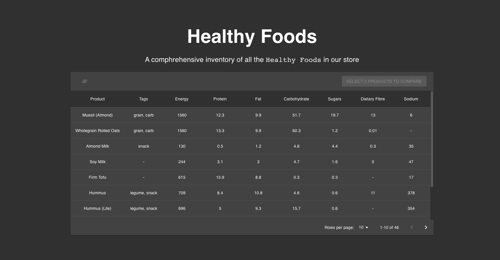
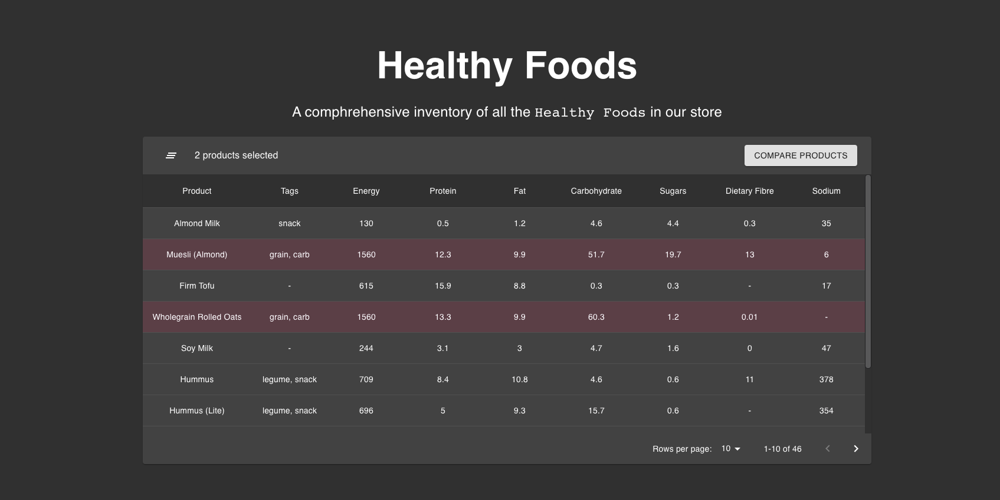
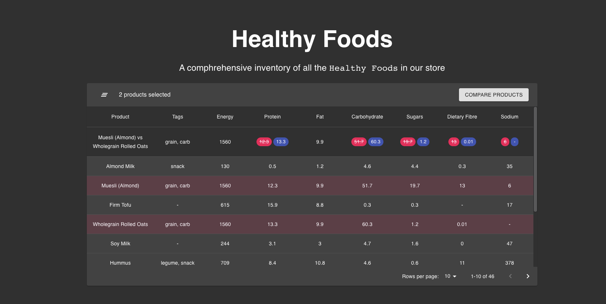

# Healthy Foods Inventory Challenge

## Description

We are the owners of a vegan-friendly store and would like you to create a visual representation of our inventory.

There are two main task described in the sections below.

### Feature 1: Display products in a rich text table

We'd like you to display the products and the nutrition information in a rich table similar to the one below:



We have already set up two API endpoints you can use to retrieve:
- the list of products and their nutrition information: http://localhost:3000/api/products
- and the information related to the product properties we want to display as an array of `{ label, name }` ovjects: http://localhost:3000/api/products/properties; you can use this to map the column names to the nutrition information returned by http://localhost:3000/api/products

Feel free to use the API handlers already build in `src/api/products.ts`

For displaying the data inside the table you can use a 3rd party tool. Our recommendations are:
- [material-ui table](https://material-ui.com/components/tables) - already imported in the repo!
- [react-table](https://www.npmjs.com/package/react-table)
- [rc-table](https://www.npmjs.com/package/rc-table)
- [react-data-grid](https://www.npmjs.com/package/react-data-grid)
- [reactdatagrid](https://www.npmjs.com/package/@inovua/reactdatagrid-community)

### Feature 2: Compare two products

The second feature is to provide the user a way to compare 2 products in terms of nutrition info.

The user should be able to select multiple products. When two products are selected, a "Compare products" button should show up similarly to the screenshot below:



When the user presses the "Compare products" button, a new table row appears at the top containing a diff between the nutrition information for the selected products. Here's another screenshot for reference:



It should work similarly to `git diff` functionality:
- the product selected first will show the nutrition values in red with a strikethrough content;
- the product selected second will show the nutrition values in a positive color: blue, green, etc.

Notes:
- the content of the cell should remain unchanged if the nutrition info is the same for both products (e.g.: same amount of protein);
- the name and tags columns can be ignored for the comparision.

## Instructions

How to attempt this challenge:

1. Create a new repo in your account and note the git url
1. Clone this repo and build it following the guidelines below: [Building the project](#building-the-project)
2. Solve the challenge
3. Set your new repo as the origin: `git remote set-url origin ${your repo url}`
4. Push your solution to your repo
5. You must follow these steps for your solution to be accepted -- forks or other methods will not be considered.

## Building the project

Please make sure you meet the [Next.js system requirements](https://nextjs.org/docs#system-requirements)

Once the repo is cloned, enter the folder and run the development server with:

```bash
npm run dev
# or
yarn dev
```

Open [http://localhost:3000](http://localhost:3000) with your browser to see the initial project.

You can start editing the page by modifying `pages/index.tsx`. The page auto-updates as you edit the file.
